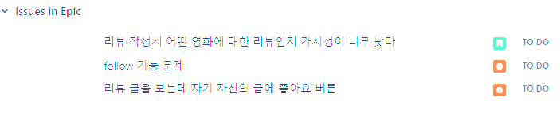
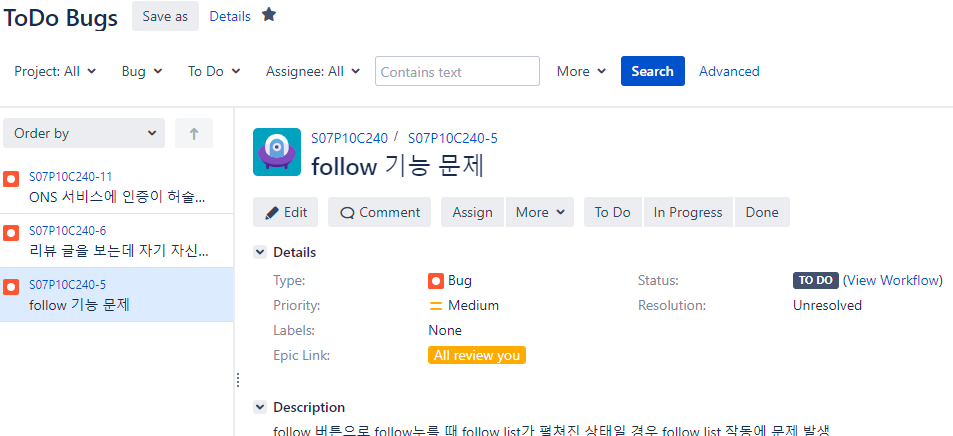
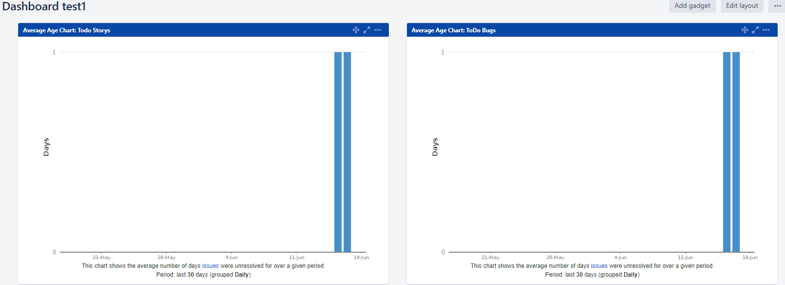

# JIRA

- 버그추적, 이슈 추적, 프로젝트 관리기능을 제공하는 소프트웨어

## Issue

### Issue type

- Epic : 큰 업무 덩어리 여러 개의 스토리 & 태스크 등을 포함하는 개념
- Story: 사용하는 유저 입장에서 쓰는 요구 사항
- Task: 구현에는 직접적으로 관련이 없는 업무들(문서작성 ...)

- Bug : 테스트 엔지니어가 버그로 리포팅 한 것

## Filter

- Issue에 등록한 Issue들을 자신이 원하는대로 Filtering하여 목록 제공

- ToDo 상태의 Bug 목록만 Filter 적용한 모습
- 이렇게 생성한 Filter 목록을 이용하여 Dashboard 생성 가능

## Dashboard

- Filter로 선택된 목록들에 관한 정보를 다양한 gadget을 이용하여 파악 가능

